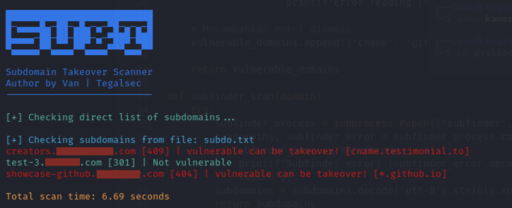

# SubT | Subdomain Takeover Scanner


## Details
SubT is a tool to check if a subdomain is vulnerable to subdomain takeover. It uses `subfinder` to search for subdomains, `dig` to check CNAME, and `curl` to check status code.

## Features
- **Subdomain Scanning**: Supports scanning subdomains from a file, a list of domains, or directly provided subdomains.
- **Vulnerability Detection**: Identifies subdomains vulnerable to takeover based on CNAME and HTTP status codes.
- **Color-Coded Output**: Provides clear and colorful output using `colorama` for better readability.
- **Support for Different Input Formats**: Handles single domains, lists of domains, and direct subdomain lists.
- **Integration with Subfinder**: Optionally integrates with Subfinder for discovering subdomains dynamically.

## Use of Tools
   - [Subfinder : ](https://github.com/projectdiscovery/subfinder)Searching for subdomains.
   - **Dig** : Checking CNAME.
   - **Curl** : Checks the status code.
## Usage
### Installation
Clone the repository :
```
git clone https://github.com/yourusername/subdomain-takeover-scanner.git
cd subdomain-takeover-scanner
```
Install dependencies:
```
pip install -r requirements.txt
```
### Command Line Usage
Scan Direct List of Subdomains
```
python subt.py subdo.txt --direct-subdomains
```
Scan List of Domains
```
python subt.py domain.txt --listdomains
```
Scan Single Domain
```
python subt.py example.com
```
```
┌──(root㉿tegalsec)-[/home/van/Project/subt]
└─# python subt.py example.com

██████████████████████████                                                                                              
█─▄▄▄▄█▄─██─▄█▄─▄─▀█─▄─▄─█                                                                                              
█▄▄▄▄─██─██─███─▄─▀███─███                                                                                              
▀▄▄▄▄▄▀▀▄▄▄▄▀▀▄▄▄▄▀▀▀▄▄▄▀▀                                                                                              
                                                                                                                        
Subdomain Takeover Scanner                                                                                              
Author by Van | Tegalsec                                                                                              
--------------------------                                                                                              
[+] Checking subdomains for domain: example.com                                                                      
hub.example.com [301] | Not vulnerable
creators.example.com [409] | vulnerable can be takeover! [cname.testimonial.to]
oneten.example.com [302] | Not vulnerable
video.example.com [404] | vulnerable can be takeover! [custom.gohire.io]
udacity.example.com [302] | Not vulnerable
tp-knowitgetit.example.com [404] | vulnerable can be takeover! [na-west1.surge.sh]
training.example.com [301] | Not vulnerable
forward-champions.example.com [301] | Not vulnerable
oneten-udacity.example.com [409] | vulnerable can be takeover! [cname.testimonial.to]
hello.example.com [302] | Not vulnerable
dashboard.example.com [302] | Not vulnerable
testimonial.example.com [301] | Not vulnerable
```
### Contribution
If you discover a new vulnerable CNAME susceptible to subdomain takeover, feel free to create a new YAML file and upload it to the vulnerable/ folder. Please include accurate information about the CNAME and relevant status codes to ensure the vulnerability's validity.
```
cname: "custom.example.com"
status_code: 404
status: "vulnerable can be takeover!"
```

### License
This project is licensed under the MIT License - see the LICENSE file for details.

### Acknowledgments
Special thanks to contributors and open source projects that inspired this tool.
- https://github.com/EdOverflow/can-i-take-over-xyz
- https://book.hacktricks.xyz/pentesting-web/domain-subdomain-takeover
